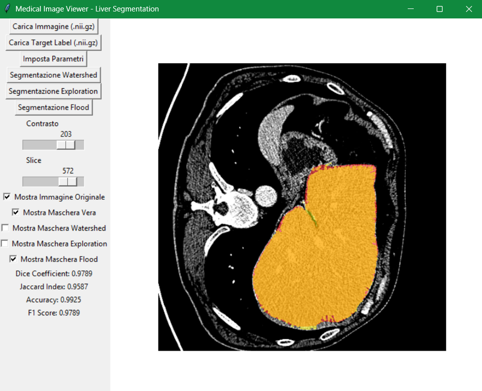
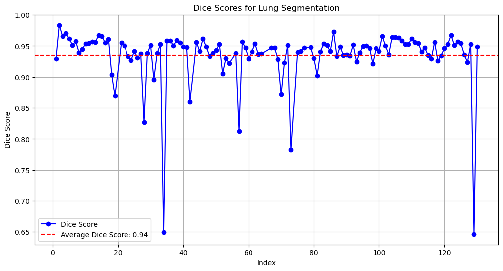
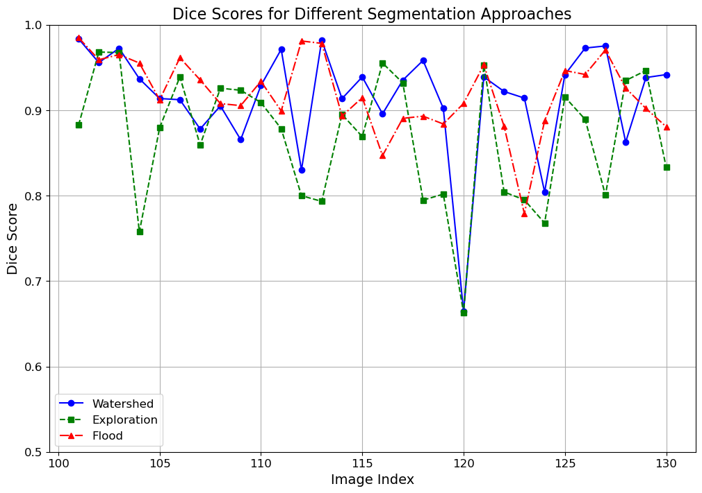
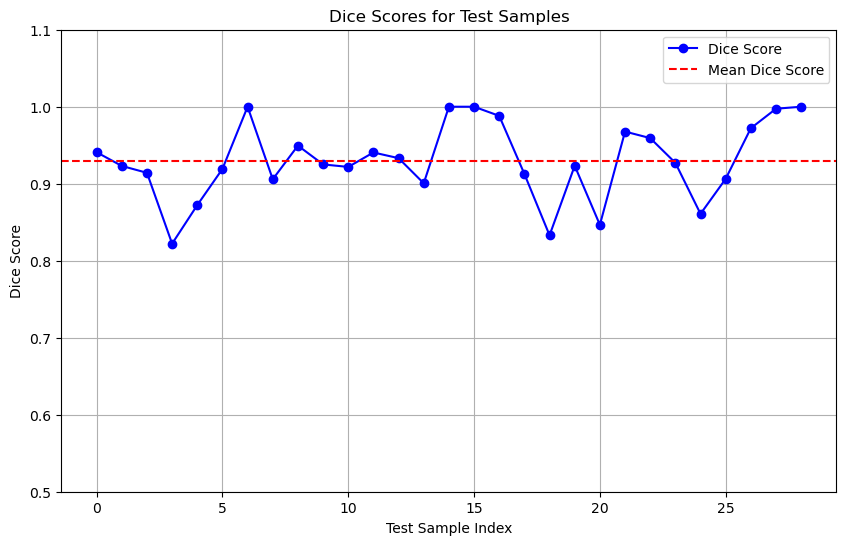

# Lung & Liver Segmentation

This project was developed as part of the Signal, Image, and Video course for the Master's Degree in Artificial Intelligence Systems at the University of Trento. The goal of this project is to perform segmentation of the lungs and liver in medical images using various image analysis techniques.
For a more detailed and theoretical description of the techniques used, please refer to the [Report.pdf](Report.pdf).
## Lung Segmentation

The lung segmentation code is available in the notebook [Lung_segmentation.ipynb](Lung_Segmentation/lung_segmentation.ipynb).


## Liver Segmentation

The liver segmentation code is available in the [Liver_Segmentation](Liver_Segmentation) folder.

### Exploration, Flood, and Watershed Approaches

These approaches are implemented in the [Processing_Segmentation](Liver_Segmentation/Processing_Segmentation) folder. The file [segmentation_functions.py](Liver_Segmentation/Processing_Segmentation/segmentation_functions.py) contains the three functions for segmentation. The file [Combined_Segmentation_GUI.py](Liver_Segmentation/Processing_Segmentation/Combined_Segmentation_GUI.py) provides a GUI for conducting segmentation on medical images.




### U-Net

The U-Net approach is implemented in the [Unet_Segmentation](Liver_Segmentation/Unet_Segmentation) folder.


## Installation

### Using Conda

1. Clone the repository:
   ```bash
   git clone https://github.com/avendramini/Lung_Liver_Segmentation.git
   cd Lung_Liver_Segmentation
   ```
2. Create the environment:
   ```bash
   conda env create -f environment.yml
   ```
3. Activate the environment:
   ```bash
   conda activate siv
   ```

### Using Pip

1. Clone the repository:
   ```bash
   git clone https://github.com/avendramini/Lung_Liver_Segmentation.git
   cd Lung_Liver_Segmentation
   ```
2. Create a virtual environment:
   ```bash
   python -m venv venv
   source venv/bin/activate  # On Windows: venv\Scripts\activate
   ```
3. Install the dependencies:
   ```bash
   pip install -r requirements.txt
   ```

## Usage

### Lung Segmentation

To run the lung segmentation, open the [Lung_segmentation.ipynb](Lung_Segmentation/lung_segmentation.ipynb) notebook and follow the instructions.

### Liver Segmentation

#### GUI for Segmentation

To use the GUI for liver segmentation, run the [Combined_Segmentation_GUI.py](Liver_Segmentation/Processing_Segmentation/Combined_Segmentation_GUI.py) script. This GUI allows you to load medical images and perform segmentation using the Exploration, Flood, and Watershed approaches.

#### U-Net Segmentation
To use the U-Net segmentation, follow the instructions in the [Unet_Liver.ipynb](Liver_Segmentation/Unet_Segmentation/Unet_Liver.ipynb) notebook.

The weights of some pre-trained U-Net models are available in the [Results](Liver_Segmentation/Unet_Segmentation/Results) folder. These weights can be used to perform liver segmentation without the need for retraining the models.

## Data

### Lung Segmentation
Place the volumes in:
- Lung_data\Volumes  
and the corresponding labels in:
- Lung_data\Labels  

### Processing Segmentation
Place the files in:
- Liver_CT  
with CT images in:
- imagesTr  
and the labels in:
- labelsTr  

### U-Net
Place the already split data within the subfolders of:
- Data

## Performance Metrics

### Lung Segmentation

The performance of the lung segmentation approach is evaluated using the Dice coefficient. The following graph shows the Dice scores for lung segmentation:



### Liver Segmentation

#### Exploration, Flood, and Watershed Approaches

The performance of the liver segmentation using the Exploration, Flood, and Watershed approaches is evaluated using the Dice coefficient. The following graph shows the Dice scores for these approaches:



Note: The models were trained with limited computational power, which may affect the performance results.

#### U-Net Segmentation

The performance of the U-Net segmentation approach is evaluated using the Dice coefficient. The following graph shows the Dice scores for U-Net segmentation:




