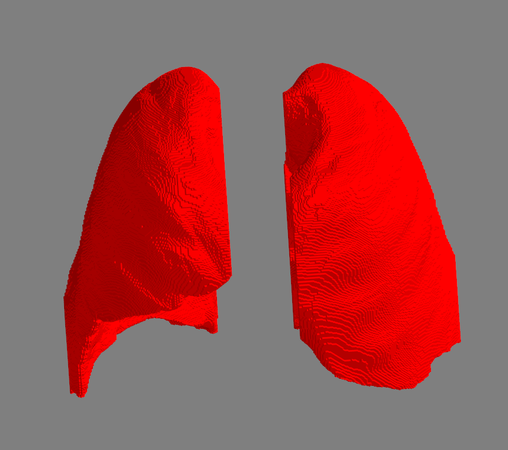
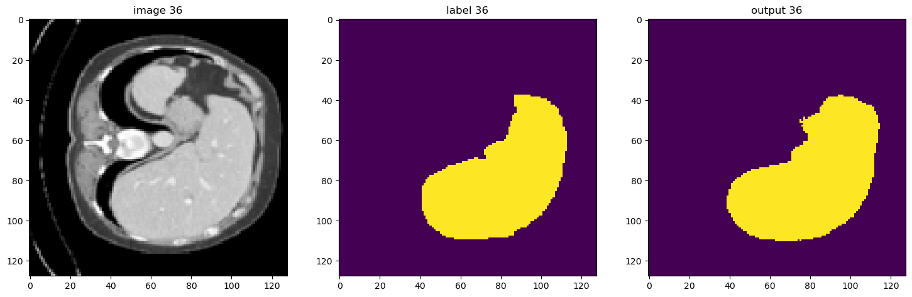

# Lung & Liver Segmentation

This project was developed as part of the Signal, Image, and Video course for the Master's Degree in Artificial Intelligence Systems at the University of Trento. The goal of this project is to perform segmentation of the lungs and liver in medical images using image analysis techniques.

## Lung Segmentation

The Lung segmentation code is entirely available in the notebook [Lung_segmentation.ipynb](Lung_Segmentation/lung_segmentation.ipynb).



## Liver Segmentation

The Liver segmentation code is entirely available in the [Liver_Segmentation](Liver_Segmentation) folder.

### Exploration, Flood, and Watershed Approaches

These approaches' code is in the [Processing_Segmentation](Liver_Segmentation/Processing_Segmentation) folder. The file [segmentation_functions.py](Liver_Segmentation/Processing_Segmentation/segmentation_functions.py) contains the three functions for segmentation used. The file [Combined_Segmentation_GUI.py](Liver_Segmentation/Processing_Segmentation/Combined_Segmentation_GUI.py) is the code of a GUI for conducting segmentation given a medical image.

### U-Net

This approach's code is in the [Unet_Segmentation](Liver_Segmentation/Unet_Segmentation) folder.



## Installation

### Using Conda

1. Clone the repository:
   ```bash
   git clone https://github.com/avendramini/Lung_Liver_Segmentation.git
   cd Lung_Liver_Segmentation
   ```
2. Create the environment:
   ```bash
   conda env create -f environment.yml
   ```
3. Activate the environment:
   ```bash
   conda activate siv
   ```

### Using Pip

1. Clone the repository:
   ```bash
   git clone https://github.com/avendramini/Lung_Liver_Segmentation.git
   cd Lung_Liver_Segmentation
   ```
2. Create a virtual environment:
   ```bash
   python -m venv venv
   source venv/bin/activate  # On Windows: venv\Scripts\activate
   ```
3. Install the dependencies:
   ```bash
   pip install -r requirements.txt
   ```

## Usage

### Lung Segmentation

To run the lung segmentation, open the [Lung_segmentation.ipynb](Lung_Segmentation/lung_segmentation.ipynb) notebook and follow the instructions.

### Liver Segmentation

#### GUI for Segmentation

To use the GUI for liver segmentation, run the [Combined_Segmentation_GUI.py](Liver_Segmentation/Processing_Segmentation/Combined_Segmentation_GUI.py) script. This GUI allows you to load medical images and perform segmentation using the Exploration, Flood, and Watershed approaches.

#### U-Net Segmentation

To use the U-Net segmentation, follow the instructions in the [Unet_Segmentation](Liver_Segmentation/Unet_Segmentation) folder.

## Results

The results of the segmentation can be visualized using the provided GUI or by running the respective scripts and notebooks. The Dice scores and other metrics are calculated to evaluate the performance of the segmentation approaches.

## Contributing

If you would like to contribute to this project, please fork the repository and submit a pull request with your changes.

## License

This project is licensed under the MIT License. See the [LICENSE](LICENSE) file for details.


